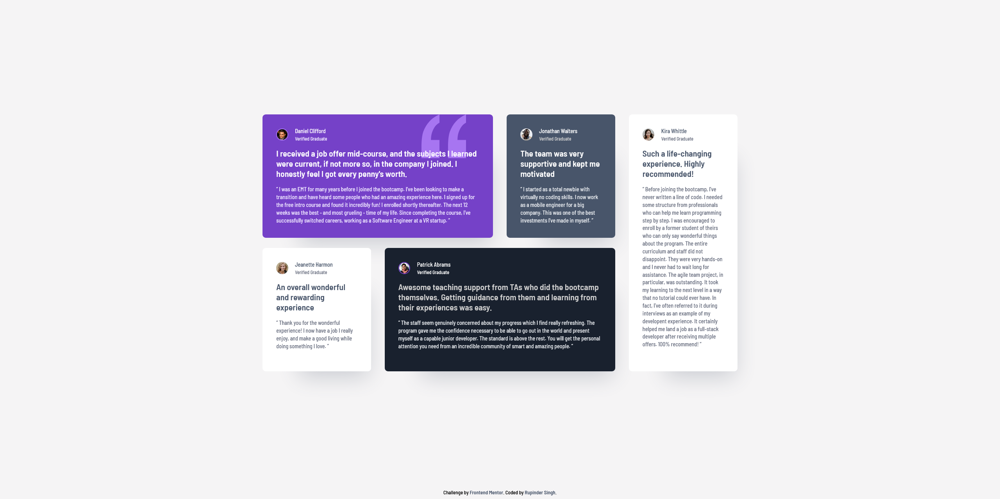

# Frontend Mentor - Testimonials grid section solution

This is a solution to the [Testimonials grid section challenge on Frontend Mentor](https://www.frontendmentor.io/challenges/testimonials-grid-section-Nnw6J7Un7). Frontend Mentor challenges help you improve your coding skills by building realistic projects. 

## Table of contents

- [Frontend Mentor - Testimonials grid section solution](#frontend-mentor---testimonials-grid-section-solution)
  - [Table of contents](#table-of-contents)
  - [Overview](#overview)
    - [The challenge](#the-challenge)
    - [Screenshot](#screenshot)
    - [Links](#links)
  - [My process](#my-process)
    - [Built with](#built-with)
  - [Author](#author)

## Overview

### The challenge

Users should be able to:

- View the optimal layout for the site depending on their device's screen size

### Screenshot

### Links

<!-- - Solution URL: [Add solution URL here](https://your-solution-url.com) -->
- Live Site URL: [GitHub Pages](https://pellia.github.io/fm-testimonials-grid-section/)

## My process

### Built with

- Semantic HTML
- CSS | Grid | Flex | Custom Properties | Media Queries
- Responsive Design
- Mobile-first workflow
- BEM

## Author

- Website - [Rupinder Singh](https://www.rupinder-singh.com/)
- Frontend Mentor - [@Pellia](https://www.frontendmentor.io/profile/Pellia)
